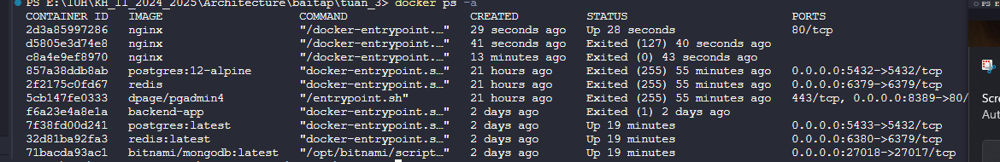
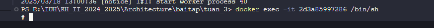

## 1.Kiểm tra phiên bản Docker

`docker --version`  
Hiển thị phiên bản Docker đang cài đặt trên hệ thống.

## 2. Chạy container thử nghiệm

`docker run hello-world`  
Chạy một container kiểm tra, hiển thị thông báo xác nhận Docker hoạt động đúng.

## 3. Tải image nginx từ Docker Hub

`docker pull nginx`  
Tải image `nginx` về máy cục bộ.

## 4. Liệt kê các images đã tải

`docker images`  
Hiển thị danh sách các images trên máy.

## 5. Chạy container nginx dưới nền

`docker run -d nginx`  
Chạy `nginx` trong chế độ nền (detached mode).

## 6. Xem danh sách container đang chạy

`docker ps`  

Hiển thị danh sách các container đang hoạt động.

## 7. Xem danh sách tất cả container (kể cả đã dừng)

`docker ps -a`  
Hiển thị toàn bộ container, bao gồm cả những container đã dừng.

## 8. Xem logs của container

`docker logs <container_id>`  
Xem nhật ký (logs) của một container cụ thể.

## 9. Truy cập vào bên trong container

`docker exec -it <container_id> /bin/sh`  
Mở terminal bên trong container để thực hiện các lệnh.

## 10. Dừng container

`docker stop <container_id>`  
Dừng một container đang chạy.

## 11. Khởi động lại container

`docker restart <container_id>`  
Khởi động lại container.

## 12. Xóa container

`docker rm <container_id>`  

Xóa một container đã dừng.

## 13. Xóa tất cả container đã dừng

`docker container prune`  
Xóa toàn bộ container không hoạt động.

## 14. Xóa image

`docker rmi <image_id>`  
Xóa một image khỏi hệ thống.

## 15. Xóa tất cả images không sử dụng

`docker image prune -a`  
Dọn dẹp toàn bộ images không sử dụng để tiết kiệm dung lượng.

## 16. Chạy container và ánh xạ cổng

`docker run -d -p 8080:80 nginx`  
Chạy container nginx và ánh xạ cổng 8080 trên máy host với cổng 80 của container.

## 17. Xem thông tin chi tiết của container

`docker inspect <container_id>`  
Hiển thị thông tin chi tiết về container dưới dạng JSON.

## 18. Tạo volume và gắn vào container

`docker run -d -v mydata:/data nginx`  
Tạo một volume tên `mydata` và gắn vào `/data` trong container.

## 19. Liệt kê danh sách volumes

`docker volume ls`  
Hiển thị danh sách các volumes trên hệ thống.

## 20. Xóa tất cả volumes không sử dụng

`docker volume prune`  
Dọn dẹp toàn bộ volumes không sử dụng.

## 21. Chạy container với tên cụ thể

`docker run -d --name my_nginx nginx`  
Chạy container nginx và đặt tên là `my_nginx`.

## 22. Giám sát tài nguyên container

`docker stats`  
Hiển thị thông tin về tài nguyên CPU, RAM mà container đang sử dụng.

## 23. Liệt kê mạng Docker

`docker network ls`  
Hiển thị danh sách các mạng Docker.

## 24. Tạo một mạng mới

`docker network create my_network`  
Tạo một mạng Docker tên `my_network`.

## 25. Chạy container và kết nối với mạng

`docker run -d --network my_network --name my_container nginx`  
Chạy container và kết nối vào mạng `my_network`.

## 26. Kết nối container với mạng

`docker network connect my_network my_nginx`  
Kết nối container `my_nginx` vào mạng `my_network`.

## 27. Chạy container với biến môi trường

`docker run -d -e MY_ENV=hello_world nginx`  
Chạy container và đặt biến môi trường `MY_ENV=hello_world`.

## 28. Theo dõi logs của container

`docker logs -f my_nginx`  
Theo dõi logs của container `my_nginx` theo thời gian thực.

